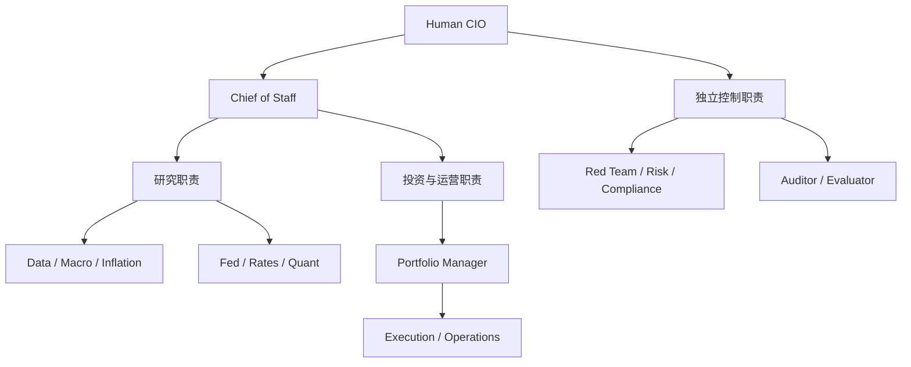
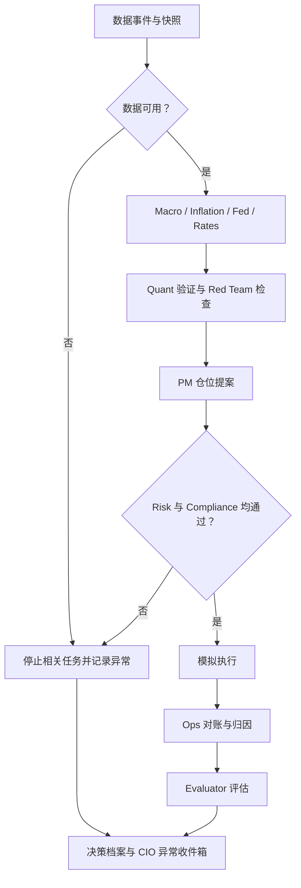

# Rates Fund OS：交给 GPT 5.6 的详细执行方案

版本：1.0｜编制日期：2026-09-05｜用途：规划交接与后续开发验收

原始需求来源：[《一人对冲基金》分享对话](https://chatgpt.com/share/6a9b9b2f-d678-83e8-af78-edde1a37945f)。本方案已读取该对话中关于任务分解、岗位设计、v0.1、开源路线与预算的内容。

本次交付是实施说明书；尚未创建或修改 GitHub 仓库，尚未运行基金系统、连接行情或执行模拟交易。文中的参数、目录和接口是拟实施规格，不是现有代码事实。

## 1. 对原对话的理解与需求优先级

用户希望建立一家由自己担任 Human CIO 的虚拟利率基金。现在以模拟盘验证组织与业务闭环，未来在有证据支持的情况下逐步提高自治程度。希望理解系统为什么这样分工、任务怎样交接、每个岗位做了什么，而不只是看到收益曲线。

核心成果：**岗位齐全、策略范围清楚、数据可追溯、风险由代码约束、订单与账本一致、运行过程可视化、开发过程可接续。**

### 1.1 哪些已经明确，哪些是本方案的新决策

| 分类 | 内容 | 执行要求 |
|---|---|---|
| 用户明确要求 | 利率策略为核心；模拟盘；所有岗位齐全 | 不得自行扩展成综合资产实盘基金 |
| 用户明确要求 | 解释拆分逻辑、任务分配逻辑、岗位职责 | 代码、文档、UI 必须使用同一套角色定义 |
| 用户明确要求 | GitHub 管理开发；UI 显示项目逻辑 | 必须交付 Issue/PR 对应关系和真实运行图 |
| 用户明确要求 | 先方案，给时间与 token 预算 | 本次只交付方案，后续模型按阶段实施 |
| 原对话的具体建议 | 14 个 Agent 岗位、5 个利率策略 Pod、9 个页面 | 本方案保留；不代表每个岗位都需要独立模型进程 |
| 原对话的方向 | 自有仓库，复用成熟组件，模型可以替换 | 保留；具体依赖须先做接入试验 |
| 本方案新增 | 离线验证、历史回放、市场数据模拟盘分开 | 不得混淆示例数据与实际市场表现 |
| 本方案新增 | 第一阶段 1 个执行策略、其余 4 个研究策略 | 五个 Pod 均有功能；按成熟度开放模拟交易 |
| 本方案新增 | 明确会计、幂等性、重启恢复、预算和验收证据 | 作为工程完成标准 |

原对话从广义宏观基金逐步收敛到利率基金，后者优先。FX、商品、Polymarket/Kalshi 暂列扩展，不加入 v0.1 关键路径。通胀与 Fed 研究保留，因为它们服务于利率判断。

当前用户已明确要把方案交给 GPT 5.6 完成，因此开发计划不依赖等待某个未来模型发布。

### 1.2 原对话中需要纠正或降级的内容

1. 模型 benchmark、未来成功率预测、示例 FundBench 分数不作为事实或验收承诺；不把模型变强等同于策略有收益。
2. 原对话对开源项目的星数、特定版本功能和成熟度描述，需要按采用的版本重新核验。本文只使用已核查的基本定位。
3. “替换 BrokerAdapter 就能实盘”仅是接口目标；真实交易还涉及市场数据、账户、证券定义、结算、异常恢复和权限，不在本期范围。
4. SQLite 换 PostgreSQL 不是无成本替换；事务、锁、并发、迁移和数值类型都需要复验。
5. “预计收益 × 信心 × 流动性”的启发式评分不是投资定价模型；不同期限、单位和风险的 edge 不可直接比较。
6. “2s10s”是曲线关系，不是可直接下单的证券代码。交易必须展开成具体工具和数量。
7. 原对话中的秒级 CPI 流程属于示意。第一版以日频数据和可审计回放为主，不承诺公告后几秒可交易。
8. 原文的法律条款和生效时间不在本方案重新背书。Compliance 在本期实施内部模拟交易政策，不宣称已完成基金法律合规。

## 2. 产品范围与完成状态

### 2.1 分成两个必须明确标识的里程碑

**v0.1a：完整组织闭环。** 14 个岗位注册完整，五个策略 Pod 具有明确输入输出；固定数据可重复运行；规则风控、模拟成交、对账、审计、UI 全部贯通。这证明工程流程能够运行。

**v0.1b：基于市场数据的持续模拟盘。** 接入具有来源和时间信息的行情；用具体工具产生模拟订单；进行日终估值和对账；连续观察至少 10 个实际交易日。这证明系统在真实数据更新下能够运行，仍不证明盈利能力。

v0.1a 完成时必须显示“离线闭环已完成，市场数据模拟盘待验收”；不能宣称整个项目完成。10 天回放不能替代 10 个前向观察交易日。

### 2.2 本期交付边界

| 本期必须有 | 暂不实现 |
|---|---|
| 14 个岗位及机器可读契约 | 14 个独立常驻 LLM 进程 |
| 五个利率策略 Pod 的研究输出与状态 | 五个未经验证的自动交易策略 |
| 一个可执行的日频利率 ETF 配置基线 | 国债期货交割、CTD、基差和掉期交易 |
| 确定性风控、模拟执行、持仓与现金账本 | 真钱交易、提现、募资 |
| 九个功能页面，可合并路由或共用组件 | 高频交易设施、大规模分布式集群 |
| 数据快照、决策链、版本和评估 | 自动训练新模型并自动上线 |
| 本地可启动、CI、GitHub 开发记录 | 默认公开部署、自动发送投资者报告 |

## 3. 任务拆分与分配逻辑

### 3.1 按业务交付物拆分

先按决策链划分，再按领域细化：观察数据、解释信息、形成假说、验证、配置、批准、执行、对账、评估。

满足以下任一条件时考虑拆分：输入与工具不同；专业判断不同；触发周期不同；错误后果不同；需要独立核查；验收方式不同。

拆分的最小单位是一个有意义、可检验的交付物。例如 Inflation Analyst 输出一个带来源、日期、误差定义的通胀研究包。下载 CSV、解析字段、算同比属于工具函数，不另设 Agent。

### 3.2 职位、任务、模型、工具分别是什么

| 对象 | 定义 | 示例 |
|---|---|---|
| Role | 长期职责及权限 | Risk Manager |
| Task | 一次具体工作 | 检查 proposal-123 的交易后风险 |
| Executor | 执行方式 | Python 规则、LLM、组合工作流 |
| Tool | 可调用能力 | read_snapshot、compute_dv01 |
| Contract | 输入输出及验收要求 | 风控必须输出规则版本及逐项检查 |
| Artifact | 可保存的业务成果 | RiskDecision、ResearchPacket |

同一模型可以承担多个岗位，但每次调用必须使用该岗位的权限、输入快照和契约。共享模型不会自动形成独立判断；Red Team 的作用是提供不同的检查目标与证据，最终仍靠确定性规则保障硬约束。

### 3.3 路由规则

任务包含 `domain / skill / risk_class / latency_class / required_tools / required_authority`。调度器先按角色注册表筛选有权限的处理器，再检查依赖、数据质量、预算、优先级。v0.1 使用固定任务模板与依赖图，不允许 LLM 临时创造工具权限或任意改写交易链。

优先顺序：风险与账本异常 > 已有订单处理 > 数据更新 > 已有仓位复核 > 新机会研究 > 扩展研究。

## 4. 14 个岗位及正式工作契约

Human CIO 是所有者，不算在 14 个 Agent 内。负责策略开放状态、风险政策版本与重大异常决策。

所有岗位都要有 `role_id、mission、inputs、tools、tasks、outputs、acceptance、kpi、authority、forbidden_actions、handoff_rules、budget_policy`。下表是最低实现要求；开发时逐项生成 YAML 契约，不得只复制成描述文字。

| ID / 职位 | 输入与工作 | 标准输出及交接 | 权限边界 | 实现与验收 |
|---|---|---|---|---|
| R01 Chief of Staff | 事件、任务模板、依赖、预算；创建和恢复运行 | RunPlan、TaskRun、异常 → 对应岗位 | 可调度；不能改变政策或批准交易 | 代码为主；重启无丢单，事件重复不重复执行 |
| R02 Data Steward | 官方宏观、行情、工具元数据；清洗、时间与修订核查 | DataSnapshot、QualityReport → 研究和估值 | 原始数据只追加；不能填造缺失值 | 代码；来源、单位、可用时间齐全 |
| R03 Macro Analyst | 增长、就业、信用及财政快照 | MacroState、变化与证据 → Fed/Rates | 只写研究 | LLM 可选；核心数字有 evidence_id |
| R04 Inflation Analyst | CPI/PCE、能源、住房等可用数据 | InflationPacket、基线预测、误差定义 → Fed/Rates | 不得把缺失预测标成零或已校准 | 代码基线＋LLM 解释；预测与实际严格按时间分离 |
| R05 Fed Analyst | 宏观、通胀、已发布声明、政策利率 | FedScenarioPacket → Rates | 无市场工具数据时不得伪造隐含概率 | 情景规则＋LLM；概率若存在须标明模型及总和 |
| R06 Rates Strategist | 曲线、研究包、策略配置 | Signal、Thesis → Quant | 可提出观点；不能创建已批准订单 | 代码信号＋LLM 解释；方向和单位正确 |
| R07 Quant Researcher | 假说、历史快照、参数与成本 | ValidationReport → Red Team/PM | 可否定统计支持；不批准权限 | 代码；时间切分、成本、基线与样本数完整 |
| R08 Red Team | Thesis、验证报告、证据索引 | ChallengeReport → PM | 可提出停止条件；不能改原始证据 | LLM 为主；至少检查数据、逻辑、成本与反例 |
| R09 Portfolio Manager | 已验证信号、反方意见、持仓、风险预算 | PortfolioProposal、OrderProposal → Risk | 只提出目标仓位；不能直连执行引擎 | 代码配置＋LLM 说明；现金及总权重可核验 |
| R10 Risk Manager | 提案、持仓、未成交订单、行情及政策 | RiskDecision → Compliance/异常队列 | 独立否决；解释模型不能更改规则结果 | 确定性代码；边界、并发、过期批准测试全部通过 |
| R11 Execution Trader | 同时通过风险与政策的订单授权 | OrderEvent、Fill → Ops | 只调用模拟执行端；不能改数量上限 | 代码；幂等、部分成交、撤单及重启一致 |
| R12 Operations | 执行端事件、独立持仓快照、现金流 | ReconciliationReport、NAV、PnLAttribution → Auditor | 可冻结异常账户；不能静默改历史账 | 代码；独立重算、差异进入异常队列 |
| R13 Compliance | 模式、工具白名单、授权链、审计完整性 | PolicyDecision → Execution/异常队列 | 可否决；不能改变规则来放行订单 | 确定性政策；本期仅内部模拟交易规则 |
| R14 Auditor / Evaluator | 全部任务、证据、结果及冻结测试集 | EvaluationReport、DailyBrief → CIO/R01 | 只追加评估；不能重写历史结果或自动提权 | 代码指标＋可选 LLM 摘要；失败分类及分母清楚 |

P&L 归因归 R12，质量审计归 R14，避免遗漏原对话的归因职能而额外堆叠岗位。

所有 14 岗位至少有一个可运行任务和一个正向/异常演示入口。无新输入时可正确返回 `NO_CHANGE`；输入不足返回 `ABSTAIN`；这与未实现的 `NOT_IMPLEMENTED` 必须分开。

## 5. 组织图与运行图

组织图解释长期职责；运行图解释一次事件。UI 不得把两者混成同一幅动画。



图中的汇总节点只是展示分组，不是新增岗位。Risk 与 Compliance 的规则管理权来自 CIO，不来自 PM。



每条连线必须代表一个实际 artifact 或事件引用。节点点击后显示输入、输出、状态、耗时、预算、版本与简要决策依据，不需要展示模型隐藏推理过程。

## 6. 架构决策与开源取舍

### 6.1 默认设计：自有模块化单体

采用一个自有仓库、一个 API、一个任务 worker、一套领域契约。第一版不要拆微服务。

| 层 | 默认方案 | 关键约束 |
|---|---|---|
| 领域模型 | Python + Pydantic | 数字带单位、对象有版本，拒绝未知关键字段 |
| 服务 | FastAPI | 业务写入只经服务层，前端无执行权限 |
| 持久化 | SQLAlchemy + SQLite + 迁移脚本 | 单 worker、WAL、短事务；并发扩展时复核 PostgreSQL |
| 任务流 | 显式任务状态机；LangGraph 为可替换研究编排适配器 | 账本和订单状态不依赖模型会话内存 |
| 数据 | 官方源优先；原始文件＋结构化元数据 | 不将缓存中的最新值用于历史决策 |
| 交易 | ExecutionPort；优先试验 NautilusTrader | 全项目只保留一个正式模拟执行权威 |
| UI | React + Vite；React Flow；图表库择一 | 初期提供中文标签、英文角色 ID |
| 事件流 | 数据库 outbox + SSE | 可补拉、按序号恢复，非动画计时器 |
| 可观测性 | 自有最小 trace/eval 表；可导出到 Phoenix | Phoenix 故障不阻塞风控与记账 |
| 测试与 CI | pytest、前端类型检查、构建、必要 E2E | 核心验收不需要付费 API 或外网 |

以上为设计建议，实施时以仓库实际环境和官方兼容矩阵锁定版本，不在方案里编造“最新版本”。

### 6.2 对原对话开源建议的复核

| 项目 | 本次确认的基本定位 | 决策 |
|---|---|---|
| [TradingAgents](https://github.com/TauricResearch/TradingAgents) | 按分析、交易、风险等角色组织的研究框架 | 参考角色交接和研究结构；不整仓 fork 为基金主干 |
| [LangGraph](https://docs.langchain.com/oss/python/langgraph/overview) | 支持持久执行、流式输出与混合确定性/Agent 工作流 | 对研究链做薄适配；不得另立业务账本 |
| [NautilusTrader](https://nautilustrader.io/docs/latest/concepts/overview/) | 支持历史回测、sandbox 模拟及交易运行环境 | 优先验证能否承接本期订单与模拟执行 |
| [Phoenix](https://github.com/arize-ai/phoenix) | AI tracing、evaluation、实验与问题排查 | 可选接入；金融验收仍由 FundBench 定义 |
| [OpenBB](https://github.com/OpenBB-finance/OpenBB) | 整合公共、授权及私有数据的工具平台 | 多数据源需求出现后再集成；官方简单源先直接接 |
| FinResearchAgent / Cortex Capital / Cents | 原对话没有足够明确的仓库定位与锁定版本 | 列为待调查参考项；未核验前不依赖或复制代码 |

这不是成熟度排行榜。本文没有实际安装上述组件或验证其所有接口，也没有确认其对本项目工具的适配情况。

### 6.3 必做的 NautilusTrader 接入试验

时间盒 4–8 小时有效工程工作量，计入 M0：

1. 核对官方安装要求与本机架构，锁定版本，记录许可证。
2. 用两只示例 ETF 和固定行情完成下单、成交、费用、撤单、持仓与现金快照。
3. 测试同一订单重复提交、进程重启、历史重放和输出事件导出。
4. 明确引擎支持什么、不支持什么，以及需要的薄适配层。
5. 形成 ADR：采用或暂缓；附实际命令、输出与失败原因。

通过则成为正式执行后端。失败时允许选择限于日频、现金账户、long-only ETF 的窄型 PaperBroker，必须记录限制；不得偷偷扩展成完整交易所引擎。正式模式只用一种执行后端，另一个最多用于测试参考。

依赖风险必须写入 ADR，不能因“原对话推荐了”跳过安装、许可证和功能验证。

## 7. 数据、工具与运行模式

### 7.1 严格区分三个模式

| 模式 | 数据 | 执行 | 可声称的结果 |
|---|---|---|---|
| DEMO | 固定 fixture，含人工构造案例 | 模拟 | 工程流程、单位和异常路径是否正确 |
| REPLAY | 带时间和来源的历史快照 | 按历史时钟模拟 | 特定样本及假设下的回放结果 |
| PAPER | 持续更新的市场数据 | 虚拟订单与资金 | 前向模拟运行结果，行情可注明延迟 |

模式写入 run、order、fill、NAV 和报告。不同模式使用独立账户和账本，不能合并收益。无网络时可以完成 DEMO，但 PAPER 必须呈现 `BLOCKED_DATA`，不能自动换假数据保持“成功”。

### 7.2 收益率曲线不等于成交行情

Treasury 的 CMT 是从收益率曲线读取的固定期限收益率，不一定对应某一实际证券；其输入为指示性报价。这意味着 DGS2/DGS10 等可用于研究，不能直接作为买卖证券的 bid/ask。[Treasury FAQ](https://home.treasury.gov/policy-issues/financing-the-government/interest-rate-statistics/interest-rates-frequently-asked-questions)、[曲线方法](https://home.treasury.gov/policy-issues/financing-the-government/interest-rate-statistics/treasury-yield-curve-methodology)

v0.1 工具分两层：

- 研究层：2Y/5Y/10Y/30Y 名义曲线、可用的实际收益率、SOFR、EFFR、CPI/PCE 等。
- 模拟执行层：默认候选 SHY、IEF、TLT；TIP 先用于 Inflation Pod 的研究候选。证券代码、交易所、币种、交易日历、价格数据、分配与拆分数据必须实际核验后加入白名单。

第一版现金账户、long-only、无杠杆，ETF 仓位调整体现久期与相对期限配置。**SHY/IEF 的多头权重调整不能称为严格 DV01 中性的 2s10s steepener。** 真正曲线价差的双腿风险可以用明确标注的合成因子账本研究，不能混入市场模拟盘 NAV。

将来若实现国债期货、TIPS 单券或掉期，另建证券模型与验收阶段，不沿用 ETF 的简化假设。

### 7.3 最小数据集

| 数据组 | 候选来源 | 必存字段 | 缺失时行为 |
|---|---|---|---|
| 名义/实际曲线 | Treasury；FRED 可作传输来源 | 期限、收益率单位、日期、可用时间、源 | 阻止相关策略更新；保留上一份只读状态 |
| 宏观 vintage | FRED/ALFRED、BLS、BEA | 观测期、发布/可用时间、修订、季调标识 | 无 vintage 则不声称无前视偏差 |
| 政策与隔夜利率 | Fed、NY Fed | 生效日期、发布日期、利率定义 | Fed 输出情景或 ABSTAIN |
| ETF 行情 | 具备可用权限的市场数据提供者 | symbol、时间、OHLCV 或 bid/ask、币种、质量 | PAPER 不成交；报价失效触发风险状态 |
| ETF 风险元数据 | 发行人资料或可验证提供者 | duration 定义、as-of、有效期、来源 | DV01 无法可靠计算则禁止新增相关风险 |
| 分红与拆分 | 发行人/行情提供者 | ex-date、pay-date、金额、拆分比例 | 隔离受影响时段；不得编造现金流 |

ALFRED 提供历史日期可获得的经济数据版本，但它本身不等同于秒级事件行情数据库。[ALFRED](https://alfred.stlouisfed.org/)

### 7.4 时间与单位规范

必须分开存储：`observation_period、source_release_at、source_available_at、ingested_at、vintage_id、timestamp_precision`。

历史研究 eligibility 使用当时实际公开可获得的时间；模拟真实运行可见性则还需要 ingestion latency。REPLAY 明确选择“公开信息可用模型”或“本系统当时实际收到的信息”，不能混用。

只有日期而没有时刻的数据不得自行设为当天 00:00。保守策略：归入已确认发布后的下一交易时段，并记录假设。UTC 为存储标准，交易日历和 America/New_York 的夏令时由库处理。

收益率内部统一 decimal：4.25% 存 0.0425；1 bp 为 0.0001。宏观同比、环比、季调和年化分别标注，不通过字段名猜测。

原始数据文件只追加，生成内容 hash；快照保存全部 source record 引用。相同输入与策略/政策版本产生相同计算结果。LLM 输出使用缓存时可以重放，但新的模型调用不要求逐字一致。

## 8. 五个策略 Pod 的实施规格

所有策略都实现 `build_features、generate_signal、validate、explain、eligibility_check`。交易表达另由 PM 和工具映射层处理。

| Pod | v0.1 具体工作 | 最低输出 | 开放状态 |
|---|---|---|---|
| Curve RV | 2s10s、5s30s 价差与滚动标准化；先做简单均值回归基线 | slope_bp、z_score、方向、参数、数据充分性、ETF 表达限制 | 首个进入模拟执行的候选 |
| Carry & Roll | 解释 carry 与 roll；在明确的曲线/工具模型下做期限比较 | 假设、预期持有期、carry/roll 分解、缺失输入 | RESEARCH_ONLY |
| Fed Path | 维护政策情景；有合格市场数据才计算市场隐含路径 | policy_state、情景、触发条件、概率来源或 null | RESEARCH_ONLY |
| Inflation | CPI/PCE 简单基线预测、名义/实际收益率比较 | baseline forecast、历史误差、breakeven proxy、限制 | RESEARCH_ONLY |
| Macro Event | CPI/NFP/FOMC 发布后窗口研究 | 事件定义、surprise 来源、窗口、样本、事件后收益 | RESEARCH_ONLY |

### 8.1 Curve RV 的明确基线

以下参数是工程起点，不是已验证投资建议。只在训练样本探索；验证/测试期间冻结。

定义 `s_t = (y10_t - y2_t) × 10000`，单位 bp。参考均值与标准差使用 t 之前的 252 个合格观测，默认至少 200 个；标准差接近零则 ABSTAIN。`z_t = (s_t - mean_past) / std_past`。

默认 entry `|z| > 1.5`，exit `|z| < 0.5`，最长持有 20 个交易日。负 z 表示相对历史偏平，假说为 steepening；正 z 为 flattening 假说。均值回归可能因制度变化长期失效，必须与无交易、固定配置基线比较。

首个市场数据模拟策略采用简单、无杠杆的 ETF 相对配置：基线 50% SHY、50% IEF；steepening 假说时 60% SHY、40% IEF；flattening 时 40% SHY、60% IEF；无合格信号时回到基线或按配置保持现金。TLT 留作后续扩展。该表达同时改变净久期和工具暴露，不能解释为纯价差收益。

实现时冻结“回到基线/保持现金”的具体账户启动和退出规则。默认账户启动为现金；数据、资格和策略门槛通过后才建立基线。每只证券不超过 60% NAV；最小换仓金额、整数股数和剩余现金均由代码处理。

研究中可另算纯因子价差：steepener 使用 +K 的 2Y signed DV01 与 −K 的 10Y signed DV01；一阶 PnL 为 `K × Δ(y10-y2)_bp`。该量是曲线风险近似，不是 ETF 实际 PnL。

### 8.2 其他四个 Pod 的最低可运行成果

Carry & Roll：用具备明确输入的合成固定息债案例演示持有期总回报；静态 par curve 的斜率本身不能直接当成真实 roll-down。缺少现金流、定价曲线或融资假设时输出缺口，不输出伪精确收益。

Fed Path：首版可以输出政策不变/更紧/更松的情景及触发条件。没有 SOFR/fed funds 合约价格与结算定义时不输出“市场隐含会议概率”。情景判断与市场价格分开。

Inflation：以最近已知的月环比为 persistence baseline，再与仅用过去窗口的均值基线比较；明确定义预测目标和发布时间。breakeven 只是通胀补偿的近似，包含其他因素，不直接标注为纯预期通胀。

Macro Event：没有历史市场一致预期数据时只能研究“发布后变化”，不能称为 CPI surprise 策略。窗口若只有日数据则用日频，不制作秒级效果。

### 8.3 模拟执行的开放条件

生命周期为 `DRAFT → RESEARCH_ONLY → REPLAY_VALIDATED → PAPER_ENABLED → PAUSED/RETIRED`。

Curve RV 首先满足：数据完整、时间切分正确、方向与单位正确、成本已计入、测试集冻结、风险和账本验收通过。Paper 开放是工程验证，不要求先宣称存在 alpha。其余 Pod 不得自行升级状态；应提交含证据的策略变更记录，由 CIO 决定研究范围与模拟权限。

### 8.4 回测协议必须在看结果前保存

默认争取至少五年合格日频历史，按时间先后 60%/20%/20% 划为训练、验证、最终测试。具体起止日期、行情版本和剔除规则保存为配置；数据不足时报告缺口，不通过随机打乱时间扩充样本。

训练期负责基线选择，验证期允许有限参数取舍，最终测试期只评估已冻结方案。跨区间的收益标签按最长持有期 20 个交易日清除重叠；测试期计算 rolling feature 可以读取此前已公开的历史，但不能用测试期结果重新拟合参数。所有尝试过的参数组合保留记录，不能只展示最好的一组。

至少比较：零利息现金基线、固定 50/50 SHY/IEF 总回报基线、策略成本前后结果及成本翻倍结果。采用同一日期、现金流、工具与公司行动处理方法。报告累计回报、最大回撤、换手、交易数、时间暴露、净成本，以及风险估计覆盖率。

若历史 ETF duration 数据不足，不得把今天发行人的 duration 回填到历史。可以单独回测价格收益并披露风险门槛未完整重现；这种结果不满足“历史风控已验证”的验收。LLM 是否参与决策也须标注，冻结的确定性基线先独立运行。

## 9. 核心对象与接口契约

### 9.1 核心对象

| 对象 | 关键字段 |
|---|---|
| DataSnapshot | id、as_of、mode、records、quality、hash、availability_policy |
| MarketQuote/Bar | instrument_id、event_time、received_at、values、currency、source、quality |
| TaskContract | name、role、required_inputs、output_schema、permissions、budgets、acceptance |
| TaskRun | id、run_id、attempt、status、input_hash、versions、usage、failure_code |
| Evidence | id、source_uri、retrieved_at、available_at、excerpt_or_field、content_hash |
| ResearchPacket | claim、evidence_ids、counter_evidence、assumptions、uncertainty、as_of |
| Signal | strategy_id、direction、horizon、unit、value、model_version、eligibility |
| TradeProposal | thesis_id、legs、instrument_ids、signed_quantities、expected_cost、portfolio_version |
| RiskDecision | proposal_hash、policy_version、portfolio_version、checks、status、expires_at |
| ApprovedOrder | proposal_hash、risk_decision_id、policy_decision_id、max_quantity、execution_mode |
| Order/Fill | stable_id、idempotency_key、instrument、side、qty、price、fees、event_time |
| LedgerEntry | entry_id、source_event_id、account、instrument、quantity_delta、cash_delta、currency |
| EvaluationReport | dataset_version、case_ids、denominators、metrics、failures、model/prompt/code versions |

审批绑定提案 hash、仓位版本、规则版本和有效期。数量、方向、证券、仓位或规则变化时必须重新检查，不能把旧 PASS 附在新订单上。

### 9.2 一个可实施的任务契约示例

```yaml
schema_version: 1
task_name: rates_curve_scan
role_id: R06
executor: deterministic_with_optional_llm_explanation
trigger: data_snapshot_accepted
inputs:
  - curve_snapshot_id
  - eligible_history_snapshot_id
  - strategy_config_version
required_tools:
  - read_snapshot
  - compute_curve_features
  - write_signal_artifact
forbidden_actions:
  - modify_raw_records
  - approve_trade
  - submit_order
outputs:
  - CurveSignalV1
  - ThesisPacketV1
acceptance:
  - all_input_records_available_as_of_run
  - rates_units_normalized
  - no_future_data_in_rolling_window
  - evidence_ids_resolve
  - signal_matches_frozen_parameters
on_missing_required_data: ABSTAIN
retry:
  transient_io_max_attempts: 3
  structured_output_max_repairs: 1
budget:
  max_llm_calls: 1
  max_input_tokens: 6000
  max_output_tokens: 1500
  timeout_seconds: 90
handoff: R07
```

代码必须区分“任务执行成功”与“业务允许继续”。一个合法的 ABSTAIN 可算正确处理，但不能计入有效信号数量或交易完成率。

### 9.3 结构化解释

每份模型输出只有有限字段：`summary、claims、evidence_ids、assumptions、counterarguments、decision、reason_codes`。核心数据从快照注入，输出中的数值引用必须与快照核对。模型不能创建新的“事实数字”来补空字段。

所有关键字段用 JSON Schema/Pydantic 验证；非法输出最多修复一次，再失败则记录并终止依赖，不进入无限自我反思。

## 10. 风控：可计算、可否决、可恢复

### 10.1 单位与方向

对多头固定收益暴露，正 signed DV01 定义为利率下降 1 bp 时的一阶价值增加；利率上升时近似 PnL 为 `−signed_DV01 × shock_bp`。

ETF 近似 `signed_DV01 = signed_market_value × effective_duration × 0.0001`。这是久期近似；duration 来源、定义、as-of 和允许陈旧期必须可见。不能把同一个固定 duration 常数永久用于所有日期。

组合同时报告：

- `net_dv01 = sum(signed_dv01)`：平行利率移动方向。
- `gross_dv01 = sum(abs(signed_dv01))`：不能用净额抵消掩盖的总量。
- bucket/key-rate DV01：只有合格敏感度数据才能称 key-rate DV01；简单按 ETF 期限归类标注为 bucket proxy。

有空头或对冲时，不把 `net_dv01 / net_market_value` 当成稳定的组合久期。第一版 long-only 可报告基于 NAV 的久期贡献。

### 10.2 初始模拟政策

以下数值仅为 $10m 虚拟账户的工程默认，可由 CIO 后续调整。每次修改形成新 policy_version，不覆盖旧配置。

| 规则 | 初始值/行为 |
|---|---|
| 初始资金 | USD 10,000,000 虚拟现金 |
| 模式 | PAPER 或独立 DEMO/REPLAY；没有 LIVE 路由 |
| 工具 | 经数据与元数据核验的白名单 ETF |
| 杠杆/空头 | 禁止；交易后现金不得低于零 |
| Gross market value | ≤ 100% NAV |
| 单证券 | ≤ 60% NAV |
| 单策略 sleeve | v0.1 只有一个执行策略，可使用账户风险上限 |
| 组合 gross DV01 | ≤ $10,000/bp；另检查净值和 bucket proxy |
| 日亏损冻结线 | 当日累计净 PnL ≤ −0.75% 日初 NAV |
| 历史回撤冻结线 | NAV 相对高水位回撤 ≥ 5% |
| 压力损失限额 | 配置冲击中最差估计损失 ≤ 3% NAV |
| 元数据、行情过期 | 拒绝新增相关风险；标记估值质量 |
| 对账有未解释差异 | 冻结相关账户新增风险，继续采集与调查 |

不沿用原文含糊的“单策略 NAV risk 25%”。资金配置、DV01 和情景损失是不同单位，必须分别定义。

最低情景：平行 ±25/±50 bp；2Y +25、10Y −25 bp；反向曲线冲击；交易成本翻倍。ETF bucket proxy 的曲线情景必须标注近似，不能宣称精确曲线风险。

### 10.3 风控状态与执行规则

`NORMAL、DEGRADED、FROZEN、HALTED` 分开。行情问题通常先 DEGRADED/FROZEN；Halt 是明确停止执行。冻结后仍允许按既有政策、可用行情和新风控检查减少风险；不在无价格时假装市价平仓。

Kill switch 取消未成交订单并阻止新增订单；不默认把仓位立刻成交为零。恢复需要原因已解决、数据/对账复核和授权动作记录，LLM 不能自行复位。

风控检查必须包含在途订单和已预留风险预算。同一事务或等效串行机制完成“检查＋预留”，防止两份分别合规的订单同时突破组合限额。

数值为 NaN/Infinity、币种不一致、负 NAV、关键元数据缺失、审批失效时一律拒绝新增风险，不以默认 0 放行。

## 11. 模拟执行、账本与归因

### 11.1 日频成交约定

日终数据产生的信号，最早在数据已经可用的下一交易日开盘后模拟成交；不能使用生成信号的同一根 bar 的开盘价格。缺少次日开盘价则不成交。

v0.1 先只支持 market-next-open 模拟订单，执行窗口与委托有效期明确。其他订单类型可返回 unsupported，不伪装完整支持。

成交价格：买入 `reference_price × (1 + cost_bps/10000)`，卖出反向。示例基础成本 2 bp、压力 5/10 bp；仅为可配置仿真假设，不称为实际报价点差。佣金单独记录，避免重复计费。

部分成交可由前一交易日已知成交量的参与率上限与订单数量确定，或由固定测试脚本产生；不使用当日尚未发生的完整成交量来决定开盘成交。没有盘口时不模拟真实队列优先级。

### 11.2 权威数据与幂等性

模拟执行端的 order/fill 事件是成交事实来源；Ops 使用这些事件构建独立账本，再与执行端的独立账户/仓位快照比较。禁止用同一张 positions 表复制两份再称对账通过。

同一 `client_order_id` 重试必须返回同一订单，不能再创造一个订单。每笔 fill 有唯一外部事件 ID；重复、延迟、乱序到达均需处理。

关键持久化：提案/授权与待发送 outbox 原子写入；发送器至少一次投递；执行端按 idempotency_key 去重；入账端按 fill_id 去重。目标是实现幂等副作用，不笼统承诺分布式 exactly-once。

### 11.3 账本最低要求

以 Decimal/明确的小数精度处理现金和数量。现金买入/卖出、费用、分红应收与到账、拆分、估值分别记事件。仓位表和 NAV 是可重建投影，不是唯一事实来源。

`NAV = cash + receivables + Σ(quantity × mark_price) − liabilities`。

成交、分红和拆分采用原始未调整价格配合显式公司行动；研究可另用总回报序列。不能同时用总回报调整价计收益又再加一次分红。

现金利息默认零并披露；如启用需独立现金流规则，不能直接把某个政策利率当作账户实际收益。

每日核对：订单状态、累计成交量、证券数量、现金、费用、公司行动、NAV。数量差异应为零；金额差异按声明的舍入容差，如 $0.01/事件、$1/账户日，并报告累计残差，禁止暗中平账。

P&L 同时按策略、证券、已实现/未实现、分配收益、费用拆分。DV01 归因是近似解释，剩余误差单列，不要求把 ETF 全部收益强行解释为平行利率变化。

## 12. 调度、恢复与预算控制

### 12.1 状态机

任务状态：`PENDING、READY、RUNNING、SUCCEEDED、ABSTAINED、FAILED、BLOCKED、CANCELLED`；业务决策状态另存 `APPROVED、REJECTED、NO_TRADE`。

RUNNING 有 lease 和 heartbeat，worker 崩溃后任务可重新认领。重试沿用逻辑任务 ID、递增 attempt。成功写入的 artifact 有唯一键，重试不能重复触发下游执行。

重试仅用于超时、短暂网络/服务失败等可恢复错误。数据质量拒绝、预算耗尽、风控否决不自动反复重跑。修正输入后创建新版本运行，保留旧失败。

SSE 事件带 `run_id、event_id、sequence、timestamp、payload_version`。客户端断线后按序号补拉；UI 不自行把未收到的节点改为完成。

### 12.2 预算在调用前生效

每次 LLM 调用前预留 input estimate＋最大 output 的预算；完成后按提供者返回的 usage 结算，支持并发预留；usage 不明则保守占用。重试、结构修复和评估调用同样计入预算。

预算分 task、role/day、fund/day 三层。未通过预检返回 `ABSTAIN_BUDGET`；规则风控、记账、对账与恢复任务不因为 LLM token 耗尽而停止。

模型 ID、可用上下文、价格和鉴权由环境配置与提供者实际能力决定。GPT 5.6 是本方案的开发执行者；不意味着运行中的每个岗位也必须使用同一模型。

Prompt、代码、策略参数、政策与数据快照分别版本化。外部文本仅作证据输入，不得改变工具权限、预算或执行模式。

## 13. UI：九个功能面，围绕“为什么这样运行”

总体风格：清晰的专业工作台，中文主标签配英文岗位名。首页优先显示模式、数据状态、任务、风险和异常，收益放在其后。缺失显示“不可用/等待数据”，不显示 0。

| 页面 | 必须回答的问题 | 最低交互与字段 |
|---|---|---|
| Command Center | 今天发生了什么，需要我处理什么？ | 运行模式、as-of、最近成功更新、运行按钮、暂停、异常收件箱 |
| Organization Graph | 谁负责什么，谁有批准权？ | 14 个岗位，职责/权限/工具/输入输出；未运行与失败分开 |
| Strategy Map | 五个 Pod 在哪个成熟阶段？ | 状态、数据缺口、最后信号、参数、验证报告、表达限制 |
| Research Inbox | 观点依据是什么，反方是什么？ | Thesis、证据、Quant、Red Team、无交易原因 |
| Portfolio | 现在持有什么，准备怎样改变？ | 当前/目标权重、数量、现金、提案、证券来源与估值时间 |
| Risk Center | 若判断错误会怎样？ | gross/net DV01、bucket proxy、压力损失、限额、规则版本 |
| Trading Blotter | 哪笔订单成交了，哪笔没有？ | proposal → approvals → order → fills 全链路；撤单/部分成交 |
| Decision Ledger | 当时为什么做、当时看到了什么？ | 冻结快照、版本、简要理由、反方、门槛、后来结果 |
| FundBench | 系统究竟哪些地方可靠？ | 样本数、完成率/弃权率、关键失败、模型成本、对比实验 |

Organization Graph 内提供“组织职责”和“本次运行”两个视图。运行状态颜色建议：待运行灰、执行蓝、成功绿、ABSTAIN 黄、失败红；同时显示文字与图标，不能只靠颜色。

最低交互：选择一个场景 → 启动运行 → 看到真实状态变化 → 点击节点读交付物 → 点订单查看授权 → 点 NAV 查看账本分解 → 重启后仍能查看同一次运行。

必须支持 5 个演示入口：正常链路、数据缺失、风险超限、重复事件/重启恢复、预算不足。演示按钮只作用于独立 DEMO 账户。

Human Inbox 的操作分为“确认已读”“修正配置”“重新运行”“恢复执行”，分别记录实际动作。确认已读不能解除风控冻结。

## 14. 代码组织与 API 规划

目录是目标结构，后续模型先检查实际仓库再落地，不因文档存在就重复创建同名项目。

| 路径 | 内容 |
|---|---|
| README.md、AGENTS.md | 用户启动指南、开发执行约束 |
| docs/PROJECT_SPEC.md | 冻结范围、需求追溯矩阵 |
| docs/adr/ | 依赖、执行后端、数据源、时间和账户模型决策 |
| docs/STATUS.md、HANDOFF.md | 已完成、验证证据、阻塞、下一任务 |
| docs/roles/、docs/strategies/ | 可读岗位/策略说明 |
| backend/domain/ | 核心对象、单位、领域约束 |
| backend/contracts/ | 14 个角色与 task schema |
| backend/data/ | 数据适配器、vintage、质量检查 |
| backend/orchestration/ | 状态机、worker、outbox、恢复 |
| backend/research/、strategies/ | 研究角色和五个 Pod |
| backend/portfolio/、risk/、compliance/ | 配置、风控、权限政策 |
| backend/execution/、operations/ | 模拟端口、事件、账本、对账 |
| backend/evaluation/、llm/ | FundBench、模型接口和预算 |
| backend/api/、migrations/ | API、SSE、数据库迁移 |
| frontend/ | 九个功能面、共享状态和图组件 |
| tests/、fixtures/、scripts/ | 必要测试、可发布样例、启动/检查脚本 |
| .github/ | CI、Issue 模板、PR 模板 |

原始私有数据、API key、完整生产 trace、个人账户状态不进入 Git。测试 fixture 必须明确来源及可再分发性。

建议 API 组：

| API | 作用 |
|---|---|
| GET /api/system、/roles、/strategies | 系统与静态契约状态 |
| POST /api/runs | 按指定 mode、scenario 或 snapshot 创建运行 |
| GET /api/runs/{id}、/events | 查询运行与 SSE 状态流 |
| GET /api/artifacts/{id} | 获取研究、风险、评估等业务成果 |
| GET /api/portfolio、/risk、/orders、/ledger | 查询账户及审计链 |
| POST /api/control/pause、/resume | 有身份和审计的控制动作 |
| POST /api/evaluations | 运行冻结测试集 |

写 API 有幂等键和并发版本检查。默认仅绑定本地；如果以后要求托管，另做身份鉴别、权限与服务部署设计。

## 15. GitHub 开发与 GPT 5.6 执行纪律

### 15.1 仓库操作

进入开发阶段先检查：当前目录、AGENTS.md、Git 状态、remote、分支、未提交改动、Python/Node 环境和已有实现。已存在的项目优先延续；不覆盖用户改动。

若已有明确授权与已配置远端，使用该仓库；若没有，不猜 GitHub 账号、不默认公开新仓库。先完成本地可审阅结构、Issue 草稿与初始化材料；只有确需指定仓库目的地时再提出一个聚焦问题。

本方案本身不授权实盘交易、公开部署或给他人发送报告。

### 15.2 Issue 与 PR

一个 Issue 对应一个独立可验收能力，分支如 `feat/m2-risk-gates`。每个 Issue 写清目标、依赖、输入输出、拟修改路径、验收、预算和阻塞处理。

推荐标签：`spec、data、roles、strategy、risk、execution、ledger、ui、eval、blocked`。看板：Backlog → Ready → In Progress → Review → Verified；Verified 必须有证据，不因代码已生成而进入。

PR 说明写四件事：解决的问题、行为变化、验证结果、剩余限制。GitHub 无权限时生成实际 Issue/PR 文本并保留，不声称已经创建。

### 15.3 防止长对话偏离

每次新一轮开始读取 `AGENTS.md、PROJECT_SPEC.md、STATUS.md、HANDOFF.md`，检查当前代码。不要从聊天印象猜进度，不要重新设计已验收架构。

每次阶段结束更新：实际 SHA、已通过的检查、未通过/未运行的检查、已知限制、下一条具体任务、恢复命令。命令必须来自真实测试结果；不能写“已运行”来描述计划中的命令。

用户说“继续”时推进当前依赖链中的下一任务。可逆的实现和修复不反复问同一许可。遇到真实凭据/数据授权/外部目的地阻塞时，先完成其余独立可做工作，再明确指出阻塞。

## 16. 分阶段实施计划

时间为一个有工具权限的开发模型配合人工审阅的有效工程工作量估计，不是墙钟交付保证；不假定并行子 Agent。token 为开发过程中累计输入＋输出估计，已考虑常规调试，但不含长期运行。

| 阶段 | 具体任务 | 可验收成果 | 依赖 | 小时 | token |
|---|---|---|---|---:|---:|
| M0 基线与取舍 | 读取仓库；冻结规格；Nautilus 小试验；数据源可行性；ADR | 有据可查的依赖/数据决策及可启动骨架 | 无 | 6–12 | 60k–120k |
| M1 契约与持久状态 | 14 角色；核心 schema；数据库；任务/outbox；最薄 UI | 一个任务持久化、状态可见、重启可查 | M0 | 10–18 | 90k–180k |
| M2 单策略端到端 | 固定曲线；规则基线；PM；Risk/Policy；执行；账本 | 一笔订单和一次拒绝的完整链 | M1 | 16–28 | 150k–280k |
| M3 数据与时间正确性 | 官方宏观、行情、vintage、公司行动、日历 | DEMO/REPLAY/PAPER 隔离；数据质量报告 | M2 | 12–24 | 100k–220k |
| M4 全岗位与五 Pod | 研究角色；四个研究 Pod；Red Team；预算与模型适配 | 14 岗位可运行、五 Pod 有实质输出 | M3 | 14–26 | 140k–280k |
| M5 九个 UI 功能面 | 图、任务流、证据抽屉、订单/风险/账本、异常 | 五种场景可见、可追溯、可恢复 | M4 | 14–24 | 140k–260k |
| M6 FundBench 与交接 | 故障注入、冻结测试集、CI、安装和恢复指南 | v0.1a 验收包、全新环境启动证据 | M5 | 12–22 | 120k–240k |
| M7 前向模拟观察 | 启动 PAPER；每天数据/风险/对账/报告；修复 | v0.1b 至少 10 个实际交易日的运行报告 | M6＋合格数据 | 6–12 | 50k–120k |
| 合计 | 不含外部等待与行情采购 | — | — | **90–166** | **850k–1,700k** |

加 20%–30% 不确定性缓冲：有效工程工作量约 108–216 小时、开发 token 约 1.02m–2.21m。按每天 3–5 小时有效推进，大致为 4–15 个工作周；M7 的 10 个实际交易日观察期另计或与非关键完善交错。API 权限、数据缺口及返工可能延长时间。

第一条完整固定数据闭环预计 M0–M2 合计 32–58 小时、300k–580k token。相比一次追求全系统，这是最早能够看见真实组织交接与模拟订单的检查点。

预算是上限管理的起点；M2 完成后按实际每任务成本重估剩余工作，不为了“用完预算”继续探索。

### 16.1 初始 Issue 列表

| Issue 代号 | 任务 | 完成证据 |
|---|---|---|
| I01 | 仓库与依赖/data feasibility 审核 | 清单、ADR、试验日志 |
| I02 | 核心对象和 14 岗位契约 | schema 校验与 registry 测试 |
| I03 | 持久任务、outbox、SSE | 重启后同一 run 可查询 |
| I04 | 固定数据 Curve RV 基线 | z-score、方向、时间窗口用例 |
| I05 | PM 与风险预留 | 含在途订单的限额边界测试 |
| I06 | Policy 与授权绑定 | 被篡改/过期审批拒绝 |
| I07 | 模拟执行适配器 | 正常/重复/撤单/部分成交 |
| I08 | 独立账本与对账 | 注入错误可被检出，残差可解释 |
| I09 | 实际数据及 vintage | 来源、时间、修订、缺失报告 |
| I10 | 全研究角色与五 Pod | 每个 Pod 正常及缺失输入案例 |
| I11 | 模型调用与预算 | 调用前拒绝、重试计费、缓存版本 |
| I12 | 九个 UI 功能面 | 五场景 E2E 与截图 |
| I13 | FundBench 与 CI | 冻结数据集、失败清单、运行证据 |
| I14 | 安装/恢复文档及前向观察 | 新环境启动记录、10 日报告 |

## 17. 日常运营 token 与金额预算

岗位完整不等于每个岗位每日都调用模型。Data、Risk、Execution、Ops、Compliance 的硬逻辑使用代码；无数据变化时研究缓存复用。

### 17.1 正常日示例预算

| 调用 | 次数 | 每次输入/输出 | 小计 |
|---|---:|---:|---:|
| Macro、Inflation、Fed、Rates 解释 | 共 4 次 | 6k / 1.5k | 30k |
| Red Team | 1 次 | 8k / 2k | 10k |
| PM 决策解释 | 1 次 | 5k / 1k | 6k |
| Auditor 日报摘要 | 1 次 | 4k / 1k | 5k |
| 基础合计 | 7 次 | 输入 41k，输出 10k | **51k** |

正常日软目标约 40k–80k，硬上限先设 120k；事件日可启用一次额外完整更新，硬上限 200k。需要改变上限时形成配置变更，不让 Agent 自行扩容。DEMO/核心 CI 使用 mock/replay 模型，可做到 0 付费 token。

原对话 200k–350k/普通日、400k–800k/事件日不是必需成本。本方案通过代码计算、事件触发、证据快照和缓存减少重复阅读；实际数值在前 20 个完整 run 后校准。

### 17.2 费用计算

开发 token 与运营 token 分账。不能把总 token 乘以单一价格，也不能假定聊天订阅覆盖系统 API 运行。

设普通输入、缓存输入、输出的实际计费单价分别为 `P_in、P_cache、P_out`，每百万 token 计价：

`Cost = uncached_input/1e6 × P_in + cached_input/1e6 × P_cache + output/1e6 × P_out + tools/data/hosting charges`。

若提供者还有额外可计费项目，按 usage 和合同补入；单价与币种、核验日期入配置。本文不引用未核验的 GPT 5.6 价格。

上表正常日示例、忽略缓存时：22 日 token 成本为 `0.902 × P_in + 0.220 × P_out`。市场数据费、托管费、开发过程费用单独列示。

## 18. FundBench 与不可妥协的验收

### 18.1 三类质量分别评估

工程正确性：权限、单位、时间、幂等、恢复、账本。必须有硬门槛。

研究质量：证据支持、校准、对反例的处理、预测误差。不能仅由另一个模型打“优秀”。

投资结果：净成本后收益、风险与基线差异。短期盈利不代替前两项，短期无利润也不代表工程失败。

### 18.2 最小冻结测试集：50 案例

| 类别 | 个数 | 关键案例 |
|---|---:|---|
| 数据与时间 | 10 | 未来修订、日期精度、单位错、行情过期、公司行动 |
| 策略与组合 | 10 | z 符号、历史不足、非平稳、无信号、目标与数量转换 |
| 风险与政策 | 12 | gross/net、在途订单、限额边界、NaN、审批篡改、冻结 |
| 执行与账本 | 12 | 重复 fill、部分成交、撤单竞态、重启、分红、拆分、差异 |
| Agent 与预算 | 6 | 非法 JSON、缺失引用、证据注入、预算耗尽、修复上限 |

测试数据和 oracle 独立于生产函数定义；不能仅把同一公式在测试里照抄一遍证明自己正确。风险、会计和时间类优先用可手算案例、守恒关系和故障注入。

### 18.3 硬门槛

- 所有执行订单均可追溯到合格快照、提案、风控与政策授权，覆盖率 100%。
- 测试集中的不合规订单实际执行数为 0；报告同时显示测试场景范围，不能声称现实风险永远为零。
- 重复提交与重启测试的额外成交、重复入账数为 0。
- 对账差异必须在声明的舍入容差内，所有人为注入差异都能检出。
- 回放不读取截止时间后的记录；抽样检查数据、模型训练窗、特征和交易时点。
- 14 个岗位和五个 Pod 均可运行；未完成不能靠静态状态卡掩盖。
- 核心 DEMO、类型检查、构建和 CI 可在无付费 key 的环境通过。
- UI 能正确展示 ABSTAIN、REJECTED、BLOCKED、FAILED 和恢复，状态来自后端。

### 18.4 运行指标与统计口径

任务完成率、首次完成率、重试后完成率分别报告。业务可用产出率单列；ABSTAIN 不假装成产出。人介入率明确按 run 还是 task 统计。

研究评估：证据可解析率不等于证据支持率，需要检查 claim 与 source 是否一致。连续预测使用 MAE/RMSE；区间预测比较名义覆盖率与实际覆盖率；概率预测可用 Brier/log loss 与校准曲线。必须报告样本数与评估区间。

模型比较固定任务集、工具权限、预算和数据快照，区分模型变化与 prompt/harness 变化。新的 LLM 在历史任务上可能已有后见知识，因此历史 replay 不是完全无污染的金融预测实验；优先补充匿名化数值用例和前向评估。

不要要求新的模型输出与旧模型逐字相同；要求 schema、证据和权限合格。历史决策重现使用归档输出。

首期运行目标可设“有效任务处理率 ≥80%、人介入 run <20%”，但样本少时只给计数，不宣称统计稳定。硬风控门槛不能被总体平均分覆盖。

### 18.5 M7 十个交易日的观察清单

每天实际更新：行情/宏观数据状态、任务和费用、提案和拒绝、订单和公司行动、日终 NAV/风险/对账、未解决异常。

最终报告分别列出观察成功天数、故障天数、数据不完整天数和恢复时间。没有信号也是有效一天；没有运行不能算成功一天。不要用连续 10 天观察推算年化 Sharpe 或盈利概率。

## 19. 典型异常与处理责任

| 异常 | 系统动作 | 责任岗位 | 恢复条件 |
|---|---|---|---|
| CPI 修订覆盖历史 | 拒绝覆盖，创建新 vintage | R02 | 历史查询返回旧版本，新运行引用新版本 |
| 市场报价失效 | 不成交；估值保留旧 mark 并标注不可交易 | R02/R10 | 有合格新行情并重新检查 |
| 缺少 duration | 拒绝新增相关 DV01 风险 | R02/R10 | 合格元数据到位 |
| Quant 样本不足 | 停在研究阶段 | R07 | 足够数据或调整研究问题并新版本验证 |
| Red Team 与 thesis 冲突 | PM 明确接受/不接受及理由；必要时 NO_TRADE | R08/R09 | 新证据或明确的约束决策 |
| LLM 预算耗尽 | 停止可选研究，账本和风控继续 | R01 | 下周期预算或授权的新预算配置 |
| fill 重复/乱序 | 去重/等待缺失前序，记录异常 | R11/R12 | 顺序与累计数量核验 |
| 账户对账不平 | 冻结新增风险，保留原始证据 | R12 | 已解释差异并完成修复记录 |
| worker 崩溃 | lease 过期恢复任务；执行副作用去重 | R01/R11 | 恢复测试与账户核验通过 |
| 数据源/模型不可访问 | 明确 blocked，继续可完成的独立任务 | R01 | 权限/服务恢复；不能编造成功 |

## 20. 给 GPT 5.6 的完整启动指令

把本文件上传给后续模型，并复制以下指令即可。指令用于开始开发；若当前仅讨论方案，不执行仓库写入。

> 你是 Rates Fund OS 的实施负责人。完整阅读附件《Rates Fund OS：交给 GPT 5.6 的详细执行方案》，以其中用户确认的范围为优先约束。目标是完成 14 岗位、五个利率研究 Pod、一个日频市场数据模拟策略、规则风控、独立账本、九个 UI 功能面、FundBench 与 GitHub 交接记录。所有交易仅模拟。
>
> 先检查当前工作区、AGENTS.md、Git 状态、remote、现有代码和开发环境；存在仓库则延续，不覆盖用户改动，不猜账号、路径、模型 ID 或 API 功能。现在执行 M0，并在无阻塞情况下进入 M1。优先做可运行的纵向闭环，再逐步补全岗位和页面。
>
> 先验证 NautilusTrader 与数据源可行性，记录 ADR；不要直接照搬原对话的开源推荐，也不要一次堆入所有框架。用代码执行数据处理、风控、订单、账本和预算；LLM 只承担有证据的解释与研究。岗位齐全不等于每个岗位调用 LLM。
>
> 区分 DEMO、REPLAY、PAPER。国债收益率不能当成交价格；ETF 配置不能称为纯 2s10s 价差。没有合格市场行情、duration 或时间信息时记录具体阻塞，不能用假数据冒充市场模拟结果。
>
> 每个阶段落实 schema、代码、必要测试、运行证据与文档。每个关键结论与动作都要能追溯到快照、版本、提案、授权和执行事件。控制重试和 token 预算，禁止无限反思循环。
>
> 按方案的 Issue 与里程碑推进。可逆实现和修复不反复请求同一确认；真实外部权限或数据阻塞时先完成其他已授权工作，再一次性说明缺口。未获授权不公开部署、不自动交易真钱、不发送报告给他人。
>
> 每轮完成后更新 docs/STATUS.md 与 docs/HANDOFF.md。汇报只写：实际完成内容、实际验证结果、真实限制、下一具体任务。区分已通过、未通过、未运行。不声称完成没有执行的操作，不给未经验证的一次性启动命令。
>
> 现在开始 M0。先给出读取仓库后的事实、拟采用的最小结构与接入试验结果，再保存具体实施材料并继续可执行工作；不要只重复方案。

## 21. 后续模型的标准交接格式

每个阶段结束至少写入下列信息；字段值必须来自当次操作事实。

```yaml
milestone: Mx
status: in_progress_or_verified
repository: actual_remote_or_local_only
branch: actual_branch
commit: actual_sha_or_uncommitted
completed:
  - concrete_behavior_and_artifact
verification:
  passed: []
  failed: []
  not_run: []
known_limitations: []
data_mode: DEMO_or_REPLAY_or_PAPER
budget:
  observed_usage: available_or_unknown
  remaining_estimate: estimate_with_basis
next_issue: exact_task
resume_steps:
  - commands_verified_in_this_environment
```

若会话中断，下一模型依次读取仓库说明、当前状态、交接文件及对应 Issue，再检查实际代码与测试。不可仅凭上一条自然语言“已完成”决定跳过风控或账本验收。

## 22. 最终交付检查清单

- [ ] 自有仓库身份与现有代码处理已记录，未覆盖用户改动。
- [ ] 架构、数据源、执行后端、许可与限制有 ADR。
- [ ] 14 个岗位有契约、处理器、输入输出与异常行为。
- [ ] 五个 Pod 有实际研究功能；执行开放状态真实。
- [ ] 一条具体 ETF 工具的完整模拟链已运行。
- [ ] 收益率研究、合成因子结果与实际市场数据模拟盘已分开。
- [ ] 风控包含 gross/net、在途订单、陈旧数据和授权失效。
- [ ] 订单、成交、现金、公司行动与账本可重建、可核对。
- [ ] 每次运行可追溯、可恢复、幂等；LLM 成本可计量。
- [ ] 九个 UI 功能面读取真实后端状态，五个演示场景可用。
- [ ] 50 案例 FundBench 与关键不变量通过，失败范围透明。
- [ ] 新环境启动/恢复说明实际验证，CI 不依赖付费 key。
- [ ] v0.1a 与 v0.1b 分开验收，十个前向交易日观察没有被回放替代。
- [ ] 最终报告不把工程成功、模型分数或短期盈利当作策略有效性证明。

这份方案的执行重点是把“虚拟基金组织”变成可检查的业务系统：每个岗位有成果，每个成果有来源，每个动作有授权，每个运行有账，每个阶段有证据。
